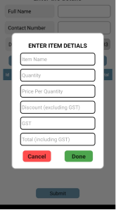
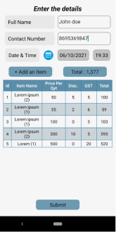
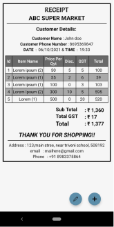

# ReceiptGenerator
This React Native app helps sotre owners generate receipts online.
One can customize the receipt specific to thte customer they are sending it to. They can add shop info(name, address, contact details), add customer details and as many items the customer buys along with the details of each item such as quantity, price per quantity, discount, GST.

## HOME PAGE

On clicking on Generate a Receipt button you will be redirected to the following page where you can enter the details to be shown in the receipt

In this page you need to enter customer full name, contact number, date and time. 
On clicking on the Add an item button a model will show up. 

Press Done after entering all the info and those details will be shown in the form of a table as shown below. 

You can add as many items as you need and they will be cascaded in the table and the total amount to be paid will be shown next to total option. 
Once you are done entering all the required information click on submit button. 

### Every input is necessary here. Failing to enter any of the details will show up an error message and you cannot move forward until you fill those info. 

This will take you to another page which has the final receipt containing all the data. 
It also has two buttons floating in the bottom right corner which are dedicated for editing the current page and creating new receipt. 

